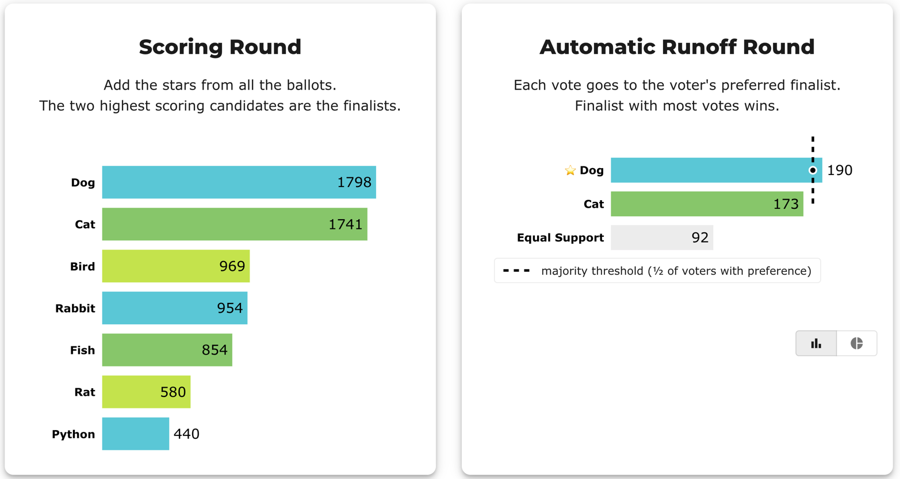
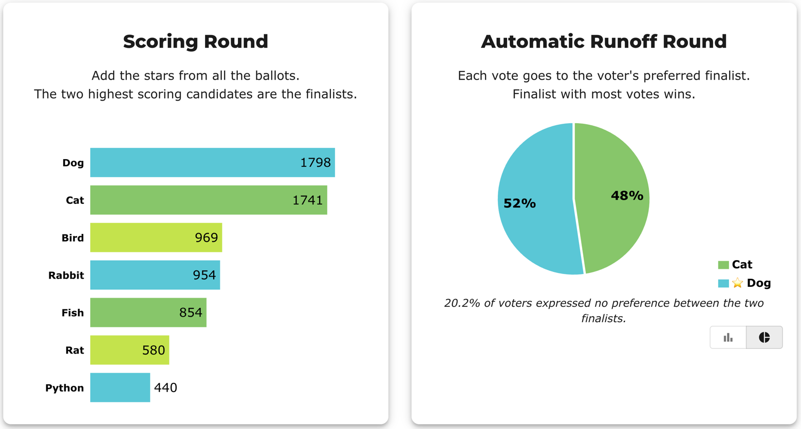
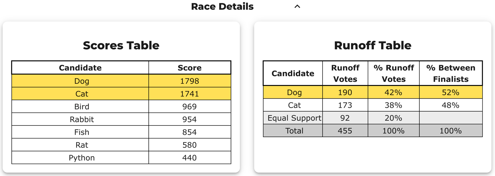
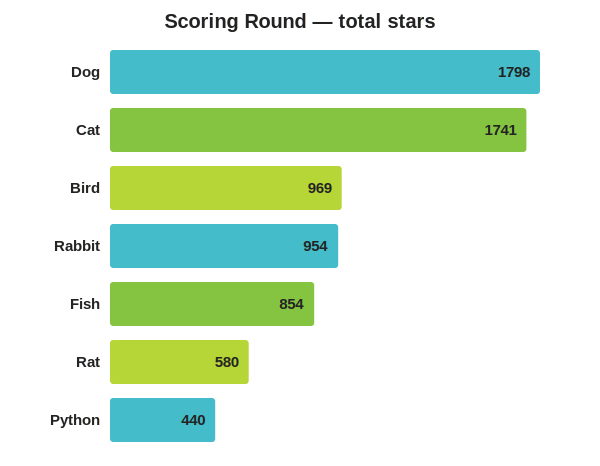
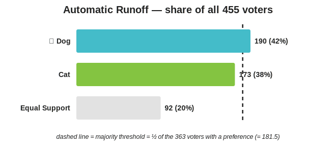
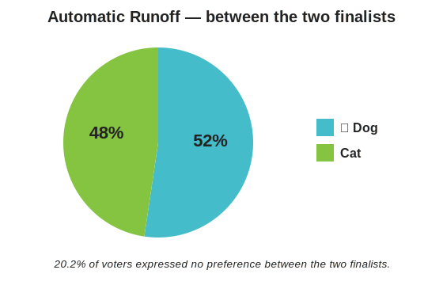

# Reading the Runoff Percentages — Two Denominators, One Winner

**One line:** in the Automatic Runoff, the *same* vote count is shown as **two
different percentages** — out of **all** voters, and out of only the voters who
**expressed a preference** between the two finalists. The winner needs a majority of
the second group, not the first. The gap between the two numbers is the **Equal
Support** voters, who scored both finalists the same.

→ The no-preference bucket is [`Equal Support`](../../GLOSSARY.md); why those ballots
still count is [Are equal-score votes discounted?](../../../interviews_conversations/are_equal_score_votes_discounted.md).
Reading the whole report: [How to read a STAR report](./reading_a_star_report.md).

---

## The example (the Dog/Cat race, 455 voters)

Seven candidates, Dog wins. The Scoring Round adds every star and takes the top two —
**Dog (1798)** and **Cat (1741)** — as Finalists.

The Automatic Runoff then compares *only those two finalists*, giving each ballot's
full vote to whichever of Dog/Cat it scored higher:

| In the runoff | Votes | of **all 455** | of the **363 with a preference** |
|---------------|------:|---------------:|---------------------------------:|
| **Dog** (winner) | 190 | 42% | **52%** |
| Cat | 173 | 38% | 48% |
| **Equal Support** | 92 | 20% | — |
| Total | 455 | 100% | 100% |

Those are the two percent columns BetterVoting shows ("% Runoff Votes" and "% Between
Finalists"), and the two chart views — same runoff, two ways of slicing it:

The **bar chart** uses the all-voters numbers (42 / 38 / 20) and draws the dashed
*majority threshold* at half of the voters with a preference — Dog's bar is the only
one past it.

The **pie chart** drops Equal Support entirely and shows just the two finalists
(52 / 48), footnoting *"20.2% of voters expressed no preference between the two
finalists."*

## The two denominators

This is the whole lesson. **190 votes for Dog is both 42% and 52%** — nothing changed
but what you divide by.

- **% of all voters** = `190 / 455 = 42%`. Useful for one thing: it shows how big the
  no-preference group is. Here **20%** of voters rated Dog and Cat equally, so they had
  no say in *this* head-to-head. The three numbers add to 100%.
- **% between finalists** = `190 / 363 = 52%`. This is the number that **decides the
  race**. The Equal Support voters are set aside (they declined to pick between these
  two), leaving `455 − 92 = 363` voters with a preference. Of those, more chose Dog.
  Dog and Cat's two numbers add to 100%; Equal Support has no entry here — it's the
  group that was removed to form the denominator.

## Why the winner isn't "majority of everyone"

Notice Dog wins with **42% of all ballots** — *less* than half of everyone. That is
not a flaw, and it's why the bar chart's threshold line is labelled **"½ of voters
with preference,"** not ½ of all voters.

A runoff asks one question: *of the two finalists, which do more voters prefer?* A
voter who scored Dog and Cat the same has answered "neither — they're equal to me," so
counting them against either finalist would be putting words in their mouth. The
majority bar is therefore half of the **363** who actually expressed a preference:
`363 / 2 = 181.5`. Dog's **190 clears it**; Cat's 173 doesn't. Dog is the true majority
choice *of the voters who had a preference* — a real majority, honestly earned.

## Equal Support is not "discarded"

The 92 Equal Support voters counted **fully in the Scoring Round** — their stars are
*inside* Dog's 1798 and Cat's 1741, and helped make both of them finalists. They simply
didn't break the Dog-vs-Cat tie, **because their own ballots said the two were tied**.
They're excluded from the runoff *percentage* only, and only because they asked to be.
Nothing was thrown away; the voters chose to sit out one specific comparison. (Contrast
this with an IRV *exhausted* ballot, which stops counting because the method ran out of
ranks — a method-caused loss, not a voter's choice. See
[exhausted ballots](../RCV_IRV/RCV_IRV_exhausted_ballots.md).)

## The one-sentence version

> The runoff winner needs a majority of the voters **who expressed a preference**
> between the two finalists — Dog's 190 is 52% of those 363, so Dog wins; the other
> 20% rated the two finalists equally and counted in the score round but not in this
> head-to-head.
