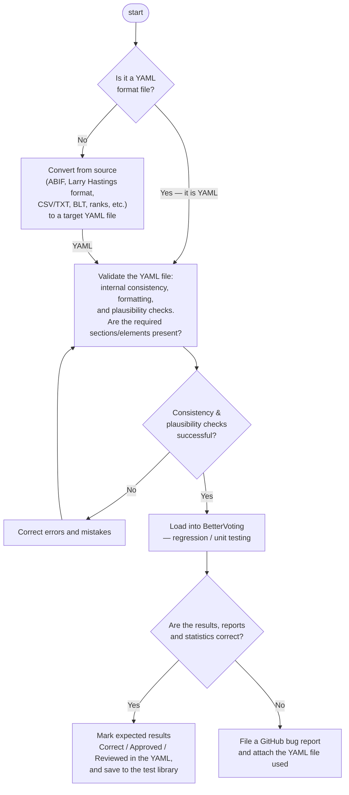

# BetterVoting and the LH Engine — One Election, Two Reports

**One line:** the same STAR election shows up in these materials as **two** result
reports — BetterVoting's **live visual display** (what voters see) and the LH `starvote`
**engine's text report** (the full audit/teaching tabulation). They're independent
implementations of the *same* STAR method, so they **agree** on the winner, the scores,
and the runoff. Two reports, one count.

→ The engine report section by section: [reading a STAR report](./LH_starvote/reading_a_star_report.md).
The runoff percentages in both: [runoff percentages](../STAR_Voting/runoff_percentages.md).
Glossary: [`BetterVoting`](../../GLOSSARY.md).
The LH engine upstream: [`larryhastings/starvote` on GitHub](https://github.com/larryhastings/starvote)
· [`starvote` on PyPI](https://pypi.org/project/starvote/).

---

## Why there are two reports

| | **BetterVoting** (bettervoting.com) | **LH `starvote` engine** (this repo) |
|---|---|---|
| What it is | the live web app voters run elections on | a text tabulator for study, teaching, auditing |
| Audience | voters, organizers | presenters, auditors, this curriculum |
| Output | interactive charts + Race Details tables | a full plain-text report (the `_tabulated.txt` copy) |
| Strength | one-click, visual, shareable | every step shown: matrix, divergence, both rounds |

They are not rivals and they don't disagree: STAR is STAR. Feed both the same ballots and
you get the same finalists, the same runoff counts, the same winner. When a lesson shows a
BetterVoting screenshot *and* an engine report, they're two views of one count — pick
whichever makes the point clearer.

How the pieces line up (same Dog/Cat race):

| BetterVoting shows … | … the engine shows the same as |
|---|---|
| **Scoring Round** bars | **Scoring Round** block (total stars; top two advance) |
| **Automatic Runoff** bars / pie | **Automatic Runoff Round** block (finalist counts + Equal Support) |
| **% Between Finalists** (52 / 48) | the `show_runoff_percent` line — *Voters with a preference: 363…* |
| **Race Details** tables | the **Preference Matrix** (For–Equal–Against) + runoff block |

See both sides for this exact race, end to end — the export YAML and the full engine
report — in the worked lesson
[A real BetterVoting election, end to end](../../../01_Single_winner/pet_real_bv_election/README.md).

## How a real election becomes a trusted example

The two reports are tied together by a pipeline. A real ballot file — a BetterVoting JSON
export, or data in ABIF / CSV / BLT / ranked form — is converted to a **YAML election**,
validated, and tabulated, then **cross-checked against BetterVoting's own result** before
it's saved as a trusted test case:

That loop is why the examples here can be trusted: every saved election has been tabulated
*and* cross-checked, and the engine's answer key is only marked "approved" once it matches.
The BetterVoting-JSON → YAML converter is `YAML_library/1_positive/01_convert_json_yaml.py`,
and a guard test (`STARVote_LH_tabulation_engine/tests/test_json_to_yaml_conversion.py`)
re-converts a real export and confirms the engine reproduces the stated winner. Two
independent implementations cross-checking each other is a *feature* — it's how you trust
a count.

---

*This page is about STAR's two reports (BetterVoting + the LH `starvote` engine).
**Ranked** ballots are a different family with a different count — see
[RCV-IRV](./RCV_IRV/README.md).*
