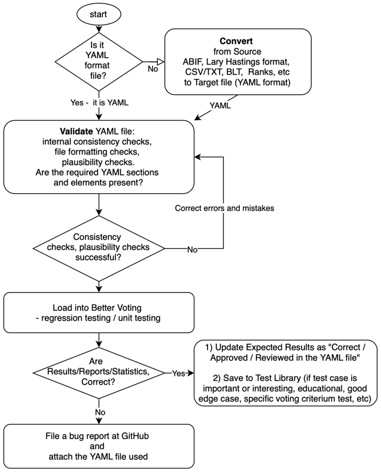

# YAML Better Voting Test Library

Python code validates "YAML files" - the YAML Better Voting **Test Library**: consistency checks and plausibility checks
before uploading into: https://bettervoting.com/. See
GitHub Repository:

- Voting Website:
- Open source code: https://github.com/Equal-Vote/star-server
- Test Cases: https://github.com/masiarek/YAML

Library contains both positive (happy path with expected winners) and negative test cases (with expected error
messages):

- **Positive** Test Cases are used for audits, certifications, IT reviews.
  These are validated Election Results - winner(s), reports, etc.
- **Negative** Test Cases are used to check that the validation programs raises expected error messages (YAML file
  with inconsistent configuration settings - internal consistency check fails - election configuration and ballot data /
  format - compatibility check).

## Voting Methods tested

### Single winner:

- STAR Voting
- Approval Voting
- Plurality Voting
- RCV IRV

### Multi-winner

- Block STAR (Basic Multi-Winner )
- STAR-PR (Proportional Multi-Winner)
- STV (Single Transferable Vote)

Additional Links:
- Why YAML format: https://docs.google.com/document/d/171HVrwNQGzqnBsdOfU-6e9QEVcMS-Joh8b61whg1z1o/edit?tab=t.0

