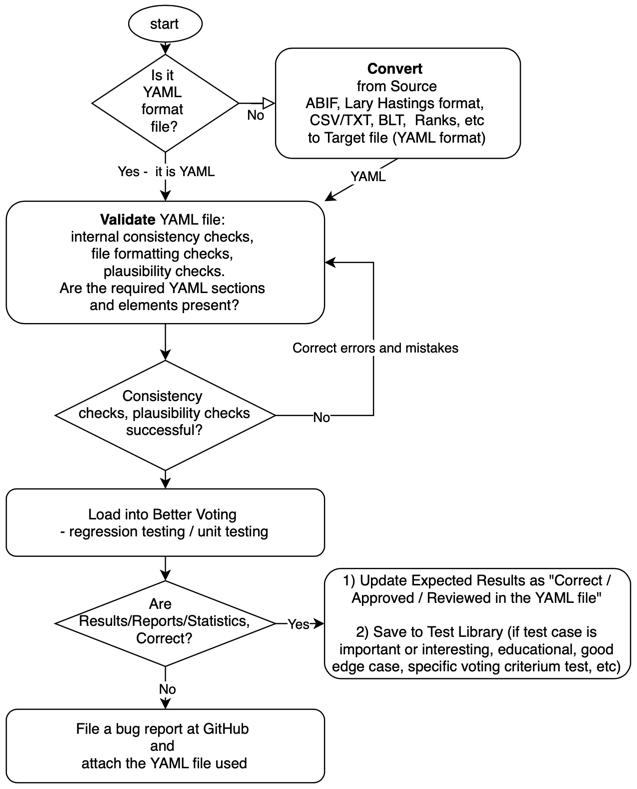
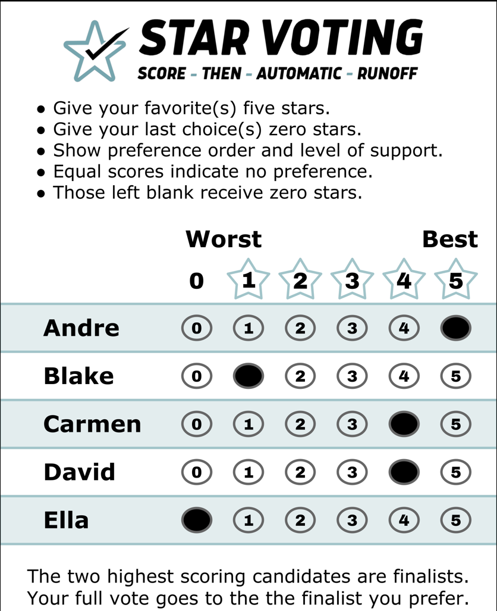

# "YAML Better Voting" Test Library

## Purpose & Scope
The core objective of this library is to ensure the structural integrity and internal consistency of YAML ballot data before it reaches downstream tabulation systems. It acts as a defensive validation layer to catch incorrect formatting and invalid configurations.

**Primary Focus**:
This testing suite is purpose-built to thoroughly flesh out and support the testing environments for:

* STAR Voting (Single-Winner)
* STAR Multi-Winner (Block STAR, STAR-PR)
* Approval Voting
* RCV-RR

The library rigorously tests both positive test cases (ensuring valid configurations process cleanly) and negative test cases (ensuring purposefully flawed data throws the exact, expected error messages) for these core methods.

**Secondary Focus**:
While the schema is capable of parsing and validating standard RCV-IRV and Plurality ballots, support for these methods is entirely secondary. They are covered in passing by the broader validation logic, but they are not the main priority or focus of this repository.

Python code validates "YAML files" - the YAML Better Voting **Test Library**: consistency checks and plausibility checks
before uploading into: https://bettervoting.com/. Open source code: https://github.com/Equal-Vote/star-server

Test cases: https://docs.google.com/spreadsheets/d/1EXQsABY2qEu8kKQJGQdyQHn-C89hbCnNqZoGxKXZJNE/edit?gid=0#gid=0

Library contains both positive (happy path with expected winners) and negative test cases (with expected error
messages):

- **Positive** Test Cases are used for audits, certifications, IT reviews.
  These are validated Election Results - winner(s), reports, etc.
- **Negative** Test Cases are used to check that the validation programs raises expected error messages (YAML file
  with inconsistent configuration settings - internal consistency check fails - election configuration and ballot data /
  format - compatibility check).

## Voting Methods tested

### Single winner:

- STAR Voting
- Approval Voting
- Plurality Voting
- RCV IRV

### Multi-winner

- Block STAR (Basic Multi-Winner )
- STAR-PR (Proportional Multi-Winner)
- STV (Single Transferable Vote)

Additional Links:
- Why YAML format: https://docs.google.com/document/d/171HVrwNQGzqnBsdOfU-6e9QEVcMS-Joh8b61whg1z1o/edit?tab=t.0



# Example ballot - STAR Voting:



- GitGub Link - YAML Better Voting Test Library: https://github.com/masiarek/YAML
- Similar
  idea: https://github.com/fairvotereform/rcv_cruncher/tree/9bb9f8482290033ff7b31d6b091186474e7afff6/tests/contest_sets/tabulation_test

## Testing Architecture: The "Test Case Bundle" Approach

To ensure absolute consistency across multiple data formats, this project utilizes a **Test Case Bundle** architecture. Instead of organizing test files by their file extension (e.g., all JSONs in one folder, all YAMLs in another), tests are grouped by the specific voting scenario they evaluate.

This approach establishes a single source of truth and guarantees format-agnostic validation for methods like STAR Voting (Scoring), Approval, and RCV-IRV.

### Directory Structure

Each directory under `tests/cases/` represents a self-contained test case. 

```text
tests/
└── cases/
    ├── positive/
    │   ├── 01_star_basic_scoring/
    │   │   ├── testcase.yaml      # The Source of Truth (StrictYAML)
    │   │   ├── testcase.json      # Generated regression baseline
    │   │   └── testcase.toml      # Generated regression baseline
    │   └── 02_rcv_irv_tiebreaker/
    │       ├── testcase.yaml
    │       └── testcase.json
    └── negative/
        ├── err_missing_parameters/
        │   ├── testcase.yaml      # Intentionally malformed YAML
        │   └── expected_error.txt # Exact exception string expected
        └── err_invalid_scoring/
            ├── testcase.yaml
            └── expected_error.txt
The Source of Truth (testcase.yaml)
The core of every bundle is the testcase.yaml file. We enforce StrictYAML parsing to prevent unexpected type coercion. Every valid test case must contain exactly three sections:

parameters: Defines the election rules (voting method, seats, candidates).

input_data: The raw ballot data. For testing clarity, small numbers of ballots are listed individually using a CSV-style format.

expected_results: The anticipated winners, election reports, and head-to-head (vs) matrices.

Example testcase.yaml (STAR Voting Scenario):

YAML

parameters:
  voting_method: STAR
  seats: 1
  races: 1
  candidates: [A, B, C]

input_data: |
  A,B,C
  5,1,0
  3,1,5
  0,5,1

expected_results:
  winner: A
  head_to_head:
    A vs B: [2, 1]
    A vs C: [2, 1]

Execution Strategy & Baselines
Our testing strategy follows a strict order of operations to prevent "refactoring churn":

YAML First: The testcase.yaml is written and locked in as the absolute source of truth.

Parser Validation: The Python runner strictly validates the YAML. For bundles in the negative/ directory, the runner asserts that the parser throws an exception matching the exact string found in expected_error.txt.

Baseline Generation (Snapshot Testing): Once the YAML parsing is flawless, the runner translates the data structures into our target formats (JSON, TOML, XML) and writes them to the bundle directory alongside the YAML file.